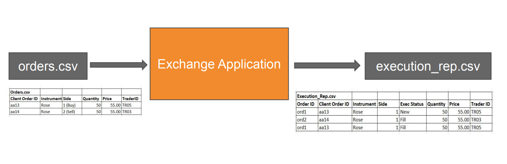

# Flower exchange Trader application

- The flower exchange is a system which
supports basic trading
-  Exchange Application - will process the incoming order against existing orders in the 
order container(known as Order Book) and do a full or partial execution.
- Every order is replied with an Execution Report by the Exchange Application indicating the status of the order

## Table of Contents

- [Architecture](#Architecture)
- [Getting Started](#getting-started)
- [Input and output](#input-and-output)
- [Implementation Details](#Implementation-details)


# Architecture

Even though we could use a high level architecture where trader application and exchange application work independently and communicate via sockets, we decided to user a much more simpler architecture in this project




## Getting Started

1. Clone the repository:

   ```bash
   git clone https://github.com/SaviNimz/Flower-exchange-Trader-application.git

2. Run the executable file of application.cpp
    ```bash
    .\application.exe 

## Input and output

In the absence of a graphical user interface (GUI), input parameters will be specified through a Comma-Separated Values (CSV) file. The outcome of the execution process will be systematically documented and recorded in a CSV file

- input file


- output file


## Implementation details 


- We've used an object oriented approach in the implementation

There are few structures and one main class in the main code. [Order](application.cpp#L17-L45) is used for storing an entry of the order book. [Orderbook](application.cpp#L77-L257) is the main class where each and every type of flower has their own orderbook. 


- There are few optimization techniques we used

1. Used a [hashmap](application.cpp#L275-L282) when creating an orderbook in the beginning to reduce the number of branching instructions and gain a constant access time

2. Used a [priority_queue](application.cpp#L84-L88) data structure to store buy and sell orders in the orderbook to improve the access time and deletion time

3. Used a [vector](application.cpp#L150) to store the execution report outputs in one transaction to reduce the number of system calls for the IO operations

- There was also the possibility of extending the program to a multi threaded application by using separate threads to handle buy and sell orders. 

We can implement multithreading by using the <thread> header in C++
Two separate threads can be created for processing buy and sell orders. The threads will iterate through the buy and sell order heaps in each OrderBook and call the respective processing functions.

While this may help the program to speedup there is also the tradeoff of having to handle deadlock situations and possible race conditions.(Mutex locks are essential in preventing race conditions here) Analyzing this must be done carefully. 

